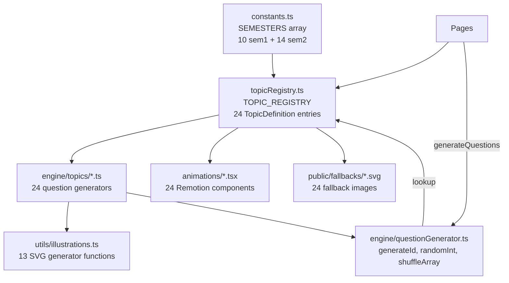

# Design Document: Curriculum Syllabus Alignment

## Overview

This design expands the HK P1 Math Learning Platform from 13 topics (7 sem1 + 6 sem2) to 24 topics (10 sem1 + 14 sem2) to fully align with the 聖公會青衣主恩小學 Crescent Education P1 mathematics syllabus. The work involves:

- **10 new question generator modules** for missing syllabus topics
- **1 new generator** for `flat-shapes` (2D shapes split from existing `shapes`)
- **Modifications to 3 existing generators** (`counting`, `addition-10`, `subtraction-10`) for syllabus alignment
- **Refocusing** the existing `shapes` generator to 3D shapes only
- **Moving** `coins-notes` from sem1 to sem2 to match the Crescent syllabus
- **Increasing difficulty** across all existing and new topics so each level is more challenging
- **11 new Remotion animation components** and **11 new fallback SVGs**
- **6 new illustration SVG generators** (`numberBondSvg`, `ordinalRowSvg`, `positionGridSvg`, `verticalMathSvg`, `rulerSvg`, `compassSvg`)
- **Updated semester constants** (reordered to match syllabus) and **topic registry** (24 entries)
- **Updated test files** for all new and modified generators

The design preserves all existing patterns: `Record<DifficultyLevel, (() => Question)[]>` generator structure, deterministic distractor generation, 繁體中文 UI text, Remotion 640×360@30fps animations, and fast-check property-based tests.

## Architecture

The platform follows a modular architecture where each topic is a self-contained unit consisting of:

1. **Question Generator** (`src/engine/topics/<topicId>.ts`) — exports `generate<Topic>Questions(difficulty, count)`
2. **Animation Component** (`src/animations/<Topic>Animation.tsx`) — Remotion React component
3. **Fallback SVG** (`public/fallbacks/<topicId>.svg`) — static 640×360 image
4. **Registry Entry** (`src/data/topicRegistry.ts`) — wires generator + animation + fallback together
5. **Illustration Functions** (optional, `src/utils/illustrations.ts`) — inline SVG for question prompts



### New File Inventory

| Layer | New Files | Modified Files |
|-------|-----------|----------------|
| Generators | `oddEven.ts`, `ordinalNumbers.ts`, `numberComposition.ts`, `positions.ts`, `numbers100.ts`, `twoDigitAddition.ts`, `twoDigitSubtraction.ts`, `measurement.ts`, `skipCounting.ts`, `directions.ts`, `flatShapes.ts` | `counting.ts`, `addition10.ts`, `subtraction10.ts`, `shapes.ts` |
| Animations | `OddEvenAnimation.tsx`, `OrdinalNumbersAnimation.tsx`, `NumberCompositionAnimation.tsx`, `PositionsAnimation.tsx`, `Numbers100Animation.tsx`, `TwoDigitAdditionAnimation.tsx`, `TwoDigitSubtractionAnimation.tsx`, `MeasurementAnimation.tsx`, `SkipCountingAnimation.tsx`, `DirectionsAnimation.tsx`, `FlatShapesAnimation.tsx` | — |
| Fallbacks | `odd-even.svg`, `ordinal-numbers.svg`, `number-composition.svg`, `positions.svg`, `numbers-100.svg`, `two-digit-addition.svg`, `two-digit-subtraction.svg`, `measurement.svg`, `skip-counting.svg`, `directions.svg`, `flat-shapes.svg` | — |
| Config | — | `constants.ts`, `topicRegistry.ts`, `engine/topics/index.ts`, `animations/index.ts` |
| Illustrations | — | `illustrations.ts` (+6 new functions) |
| Tests | — | `sem1-generators.test.ts`, `sem2-generators.test.ts`, `question-generator.property.test.ts`, `topic-registry.property.test.ts` |

## Components and Interfaces

### Question Generator Interface (unchanged)

Every generator follows the existing pattern:

```typescript
// src/engine/topics/<topicId>.ts
export function generate<Topic>Questions(difficulty: DifficultyLevel, count: number): Question[]
```

Internally, each uses:
```typescript
const generators: Record<DifficultyLevel, (() => Question)[]> = {
  easy: [...],
  medium: [...],
  hard: [...],
  challenge: [...],
};
```

### New Question Generators — Detailed Design

#### 1. `oddEven.ts` — 單數和雙數 (sem1)
- **easy**: Is N (1–20) odd or even? Options: 單數/雙數
- **medium**: Pick all odd/even from a set of 5 numbers. Options: comma-separated subsets
- **hard**: Odd/even arithmetic rules (odd+odd=?, even+odd=?). Options: 單數/雙數
- **challenge**: "How many even numbers between A and B?" combining counting + parity
- **Illustrations**: `countDotsSvg` for easy (grouped pairs to show odd/even)

#### 2. `ordinalNumbers.ts` — 序數 (sem1)
- **easy**: Row of 5 emoji objects, "第N個是什麼?" from left
- **medium**: Same row, ask from left AND right ("從右邊數第N個")
- **hard**: "從左邊數第A個到第B個共有幾個?" range counting
- **challenge**: Two-directional reasoning: "小明從左邊數是第3，從右邊數是第5，一共有幾人?"
- **Illustrations**: New `ordinalRowSvg(items, highlightIndex)` — row of colored circles/objects with position labels

#### 3. `numberComposition.ts` — 數的組合 (sem1)
- **easy**: Number bonds within 10: "5 可以分成 2 和 ?" 
- **medium**: Number bonds within 18 + missing-part: "? + 7 = 13"
- **hard**: Multiple decompositions: "10 可以分成哪兩個數？" (multiple valid answers as options)
- **challenge**: Composition + arithmetic: "8 可以分成 3 和 ?，再加 4 等於多少?"
- **Illustrations**: New `numberBondSvg(total, partA, partB?)` — circle-branch-circle diagram

#### 4. `positions.ts` — 位置 (sem1)
- **easy**: 2×2 grid with objects, "🐱在🐶的哪個方向?" Options: 上/下/左/右
- **medium**: Add front/behind, combine two terms: "🐱在🐶的左上方"
- **hard**: 3×3 scene description, determine relative positions of multiple objects
- **challenge**: Multi-step: "A在B的左邊，B在C的上面，A在C的什麼位置?"
- **Illustrations**: New `positionGridSvg(objects, positions)` — labeled grid with emoji at positions

#### 5. `numbers100.ts` — 100以內的數 (sem2)
- **easy**: Read/write two-digit numbers, identify tens and units
- **medium**: Place value: "45 中的 4 代表什麼?" + ordering 3 numbers
- **hard**: Compare with >, <, = and fill-in-the-gap sequences
- **challenge**: Place value reasoning + number patterns to 100
- **Illustrations**: `countDotsSvg` for visual tens-and-units representations

#### 6. `twoDigitAddition.ts` — 兩位數加法 (sem2)
- **easy**: 2-digit + 1-digit, no carry (23+4)
- **medium**: 2-digit + 2-digit, no carry (32+15)
- **hard**: 2-digit + 2-digit, with carry (27+18)
- **challenge**: Multi-step addition or missing addend (☐+25=61)
- **Illustrations**: New `verticalMathSvg(a, b, op)` — vertical column layout with tens/units

#### 7. `twoDigitSubtraction.ts` — 兩位數減法 (sem2)
- **easy**: 2-digit − 1-digit, no borrow (38−5)
- **medium**: 2-digit − 2-digit, no borrow (47−23)
- **hard**: 2-digit − 2-digit, with borrow (43−17)
- **challenge**: Multi-step subtraction or missing value (52−☐=28)
- **Illustrations**: Reuses `verticalMathSvg(a, b, '-')`

#### 8. `measurement.ts` — 量度 (sem2)
- **easy**: Compare two objects by length/height/weight using vocabulary
- **medium**: Measure with non-standard units (paper clips) + read ruler in cm
- **hard**: Estimate/calculate measurements, compare container capacity
- **challenge**: Measurement + arithmetic: "A繩長12cm，B繩長8cm，共長多少cm?"
- **Illustrations**: New `rulerSvg(lengthCm, objectLabel?)` — ruler with cm markings

#### 9. `skipCounting.ts` — 2、5、10的倍數 (sem2)
- **easy**: Count by 2s up to 20, one missing number
- **medium**: Count by 5s and 10s up to 100, missing numbers
- **hard**: Mixed sequences, identify which skip-count rule applies
- **challenge**: Pattern extension + reverse reasoning
- **Illustrations**: `countDotsSvg` for grouped objects showing skip patterns

#### 10. `directions.ts` — 方向 (sem2)
- **easy**: Identify 東南西北 on a compass/map
- **medium**: Left/right turns → resulting facing direction
- **hard**: Multi-step directional instructions on a grid map
- **challenge**: Compass + grid navigation + distance
- **Illustrations**: New `compassSvg(highlighted?)` — compass rose with labeled cardinal directions

#### 11. `flatShapes.ts` — 平面圖形 (sem2)
- **easy**: Identify 2D shapes (圓形、三角形、正方形、長方形)
- **medium**: Count sides and corners of 2D shapes
- **hard**: Compare 2D shapes by properties, identify shapes in composite figures
- **challenge**: Symmetry, shape transformation reasoning
- **Illustrations**: Reuses existing `shapeSvg()` (2D entries already exist)

### Existing Generator Modifications

#### `counting.ts` — Add Chinese number word matching (Req 11)
- Add to `easy` generators: `generateChineseNumberWord()` — match 一~二十 to numerals
- Add to `easy` generators: `generateNumberSequenceWriting()` — fill in missing number in 1–20 sequence
- Retain all existing generators unchanged

#### `addition10.ts` — Add zero-addend questions (Req 12)
- Add to `easy` generators: `generateAdditionWithZero()` — produces 0+N or N+0 questions
- Retain all existing generators unchanged

#### `subtraction10.ts` — Add zero-related questions (Req 12)
- Add to `easy` generators: `generateSubtractionWithZero()` — produces N−0 or N−N questions
- Retain all existing generators unchanged

#### `shapes.ts` — Refocus to 3D only (Req 13)
- Remove 2D shapes (圓形、三角形、正方形、長方形、菱形、五邊形、六邊形) from the shape pool
- Keep only 3D shapes: 正方體、長方體、圓柱體、球體、圓錐體、三角錐
- Update `name` in registry from '認識形狀' to '立體圖形'
- Adjust difficulty generators to focus on 3D properties (faces, edges, vertices)

### New Illustration SVG Functions

Added to `src/utils/illustrations.ts`:

```typescript
/** Number bond diagram: total splits into partA and partB */
export function numberBondSvg(total: number, partA: number, partB?: number): string

/** Row of colored objects with ordinal position labels */
export function ordinalRowSvg(items: string[], highlightIndex?: number): string

/** Grid with emoji objects at labeled positions */
export function positionGridSvg(objects: { emoji: string; row: number; col: number }[]): string

/** Vertical arithmetic layout with tens/units columns */
export function verticalMathSvg(a: number, b: number, op: '+' | '-'): string

/** Ruler with cm markings and optional object being measured */
export function rulerSvg(lengthCm: number, objectLabel?: string): string

/** Compass rose with labeled cardinal directions */
export function compassSvg(highlighted?: string): string
```

### Updated Semester Constants

```typescript
// src/constants.ts — SEMESTERS array updated per Req 14
export const SEMESTERS: SemesterDefinition[] = [
  {
    id: 'sem1',
    name: '上學期',
    topics: [
      'counting',           // 20以內的數
      'odd-even',           // 單數和雙數
      'ordinal-numbers',    // 序數
      'number-composition', // 數的組合
      'addition-10',        // 10以內加法
      'subtraction-10',     // 10以內減法
      'addition-20',        // 20以內加法
      'subtraction-20',     // 20以內減法
      'positions',          // 位置
      'shapes',             // 立體圖形
    ],
  },
  {
    id: 'sem2',
    name: '下學期',
    topics: [
      'numbers-100',            // 100以內的數
      'two-digit-addition',     // 兩位數加法
      'two-digit-subtraction',  // 兩位數減法
      'compare-length-height',  // 比較長短和高矮
      'measurement',            // 量度
      'flat-shapes',            // 平面圖形
      'telling-time',           // 認識時間
      'ordering-sequences',     // 排列和序列
      'data-handling',          // 數據處理
      'word-problems',          // 加減應用題
      'skip-counting',          // 2、5、10的倍數
      'composing-shapes',       // 圖形拼砌
      'directions',             // 方向
      'coins-notes',            // 認識貨幣
    ],
  },
];
```

### Updated Topic Registry

The `TOPIC_REGISTRY` in `src/data/topicRegistry.ts` will grow from 13 to 24 entries. Each new entry follows the existing pattern:

```typescript
'odd-even': {
  id: 'odd-even',
  name: '單數和雙數',
  semester: 'sem1',
  animationComposition: OddEvenAnimation,
  fallbackImage: '/fallbacks/odd-even.svg',
  generateQuestions: generateOddEvenQuestions,
},
// ... 10 more new entries
```

### Animation Components

Each new animation is a Remotion React component at 640×360, 30fps, ~5–10 seconds:

| Topic ID | Component | Visual Concept |
|----------|-----------|----------------|
| `odd-even` | `OddEvenAnimation` | Objects grouping into pairs; leftover = odd |
| `ordinal-numbers` | `OrdinalNumbersAnimation` | Characters queuing up with position labels |
| `number-composition` | `NumberCompositionAnimation` | Objects splitting into two groups with number bond |
| `positions` | `PositionsAnimation` | Objects moving to labeled grid positions |
| `numbers-100` | `Numbers100Animation` | Tens blocks and unit cubes building numbers |
| `two-digit-addition` | `TwoDigitAdditionAnimation` | Vertical column addition with carry animation |
| `two-digit-subtraction` | `TwoDigitSubtractionAnimation` | Vertical column subtraction with borrow animation |
| `measurement` | `MeasurementAnimation` | Ruler measuring objects, comparing lengths |
| `skip-counting` | `SkipCountingAnimation` | Number line with hopping markers at intervals |
| `directions` | `DirectionsAnimation` | Character on grid with compass, turning and moving |
| `flat-shapes` | `FlatShapesAnimation` | 2D shapes appearing with side/corner counts |

## Data Models

### No Type Changes Required

The existing types in `src/types.ts` are sufficient:
- `Question` — already supports `illustration?: string` for inline SVGs
- `TopicDefinition` — already has all needed fields
- `DifficultyLevel` — already has all 4 levels
- `SemesterDefinition` — already supports variable-length topic arrays

### Topic ID Mapping (Complete 24-topic list)

| # | Topic ID | Chinese Name | Semester | New? |
|---|----------|-------------|----------|------|
| 1 | `counting` | 20以內的數 | sem1 | Modified |
| 2 | `odd-even` | 單數和雙數 | sem1 | New |
| 3 | `ordinal-numbers` | 序數 | sem1 | New |
| 4 | `number-composition` | 數的組合 | sem1 | New |
| 5 | `addition-10` | 10以內加法 | sem1 | Modified |
| 6 | `subtraction-10` | 10以內減法 | sem1 | Modified |
| 7 | `addition-20` | 20以內加法 | sem1 | — |
| 8 | `subtraction-20` | 20以內減法 | sem1 | — |
| 9 | `positions` | 位置 | sem1 | New |
| 10 | `shapes` | 立體圖形 | sem1 | Modified |
| 11 | `numbers-100` | 100以內的數 | sem2 | New |
| 12 | `two-digit-addition` | 兩位數加法 | sem2 | New |
| 13 | `two-digit-subtraction` | 兩位數減法 | sem2 | New |
| 14 | `compare-length-height` | 比較長短和高矮 | sem2 | — |
| 15 | `measurement` | 量度 | sem2 | New |
| 16 | `flat-shapes` | 平面圖形 | sem2 | New |
| 17 | `telling-time` | 認識時間 | sem2 | — |
| 18 | `ordering-sequences` | 排列和序列 | sem2 | — |
| 19 | `data-handling` | 數據處理 | sem2 | — |
| 20 | `word-problems` | 加減應用題 | sem2 | — |
| 21 | `skip-counting` | 2、5、10的倍數 | sem2 | New |
| 22 | `composing-shapes` | 圖形拼砌 | sem2 | — |
| 23 | `directions` | 方向 | sem2 | New |
| 24 | `coins-notes` | 認識貨幣 | sem2 | Moved from sem1 |


## Correctness Properties

*A property is a characteristic or behavior that should hold true across all valid executions of a system — essentially, a formal statement about what the system should do. Properties serve as the bridge between human-readable specifications and machine-verifiable correctness guarantees.*

### Property 1: Universal generator validity

*For any* topic ID in the 24-topic registry and *for any* difficulty level in {easy, medium, hard, challenge} and *for any* count in [1, 10], calling `generateQuestions({topicId, difficulty, count})` should return exactly `count` questions where each question has: a non-empty `id`, `topicId` matching the requested topic, `difficulty` matching the requested level, a non-empty `prompt`, at least 2 options (ideally 4), `correctAnswerIndex` in range [0, options.length), and a non-empty `explanation`.

**Validates: Requirements 1.1, 2.1, 3.1, 4.1, 5.1, 6.1, 7.1, 8.1, 9.1, 10.1, 11.3, 13.3, 13.4, 15.1, 15.4, 16.3**

### Property 2: Registry-semester consistency

*For any* topic ID listed in the `SEMESTERS` constant array, that topic ID should exist as a key in `TOPIC_REGISTRY`, and the registry entry's `semester` field should match the semester it appears in. Furthermore, the total count of topics across both semesters should be 24 (10 sem1 + 14 sem2).

**Validates: Requirements 14.1, 14.2, 14.3**

### Property 3: Chinese text in prompts and options

*For any* topic ID in the registry and *for any* difficulty level, every generated question's `prompt` should contain at least one Chinese character (Unicode range \u4e00-\u9fff), and every non-numeric option string should contain at least one Chinese character or be a pure number/symbol.

**Validates: Requirements 15.3**

### Property 4: Two-digit addition difficulty-carry alignment

*For any* easy-difficulty question from the `two-digit-addition` generator, the sum of the units digits of the two addends should be ≤ 9 (no carrying). *For any* hard-difficulty question, the sum of the units digits should be > 9 (carrying required).

**Validates: Requirements 6.2, 6.3, 6.4**

### Property 5: Two-digit subtraction difficulty-borrow alignment

*For any* easy-difficulty question from the `two-digit-subtraction` generator, the units digit of the minuend should be ≥ the units digit of the subtrahend (no borrowing). *For any* hard-difficulty question, the units digit of the minuend should be < the units digit of the subtrahend (borrowing required).

**Validates: Requirements 7.2, 7.3, 7.4**

### Property 6: Illustration SVG generators produce valid SVG

*For any* valid input to each illustration generator function (`numberBondSvg`, `ordinalRowSvg`, `positionGridSvg`, `verticalMathSvg`, `rulerSvg`, `compassSvg`), the returned string should start with `<svg` and end with `</svg>`, and should contain valid dimensional attributes.

**Validates: Requirements 2.7, 3.7, 4.7, 6.7, 7.7, 8.7, 10.7, 15.7**

### Property 7: Arithmetic answer correctness

*For any* question generated by an arithmetic topic (`addition-10`, `subtraction-10`, `addition-20`, `subtraction-20`, `two-digit-addition`, `two-digit-subtraction`), the option at `correctAnswerIndex` should equal the mathematically correct result of the operation described in the prompt.

**Validates: Requirements 16.4**

### Property 8: Zero-addend inclusion in addition-10

*For any* batch of 50 easy-difficulty questions from the `addition-10` generator, at least one question should involve a zero addend (0+N or N+0 pattern in the prompt).

**Validates: Requirements 12.1, 12.3**

### Property 9: Zero-related inclusion in subtraction-10

*For any* batch of 50 easy-difficulty questions from the `subtraction-10` generator, at least one question should involve zero (N−0 or N−N pattern in the prompt).

**Validates: Requirements 12.2, 12.4**

## Error Handling

### Question Generator Errors

- **Invalid topic ID**: `generateQuestions()` already throws `Error` for unknown `topicId`. No change needed — the 11 new topic IDs will be registered before any code references them.
- **Zero or negative count**: Already returns `[]`. No change needed.
- **Distractor generation**: All new generators use deterministic distractor generation (pre-computed filler arrays) to avoid infinite loops. The convention of never using `while (set.size < N)` with small random pools is enforced.

### Registry Consistency

- If a topic ID appears in `SEMESTERS` but not in `TOPIC_REGISTRY`, the `generateQuestions()` call will throw. The test suite (Property 2) catches this at test time.
- If a generator is not exported from `src/engine/topics/index.ts`, TypeScript compilation will fail when `topicRegistry.ts` tries to import it.

### Illustration Fallbacks

- If an illustration SVG function receives out-of-range inputs (e.g., negative cm for `rulerSvg`), it should clamp to sensible defaults rather than producing broken SVG. Each new function will clamp inputs: `Math.max(1, Math.min(value, maxSafe))`.
- Questions without illustrations (no `illustration` field) render normally — the `QuestionIllustration` component already handles `undefined`.

### Animation Loading Failures

- The existing `RemotionAnimationPlayer` error boundary handles animation load failures by showing the fallback SVG. Each new topic provides a fallback SVG, so no additional error handling is needed.

## Testing Strategy

### Dual Testing Approach

This feature uses both unit tests and property-based tests for comprehensive coverage:

- **Unit tests**: Verify specific examples per topic per difficulty, edge cases, and content correctness
- **Property-based tests**: Verify universal properties across all topics, difficulties, and random inputs using fast-check

### Unit Tests

Update existing test files:

**`src/engine/topics/sem1-generators.test.ts`**:
- Add `odd-even`, `ordinal-numbers`, `number-composition`, `positions` to `SEM1_TOPICS` array
- Existing test loop covers all 3 difficulties × structural validation automatically

**`src/engine/topics/sem2-generators.test.ts`**:
- Add `numbers-100`, `two-digit-addition`, `two-digit-subtraction`, `measurement`, `skip-counting`, `directions`, `flat-shapes` with dedicated `describe` blocks
- Each block tests 3 difficulties (easy, medium, hard) using `assertValidQuestions`

**Content-specific unit tests** (new file `src/__tests__/unit/new-topics.test.ts`):
- Verify `odd-even` easy questions contain 單數/雙數 in options
- Verify `ordinal-numbers` easy questions contain 第 in prompt
- Verify `number-composition` easy questions involve number bonds within 10
- Verify `counting` easy questions include Chinese number words (一~二十)
- Verify `addition-10` easy questions include zero-addend cases
- Verify `subtraction-10` easy questions include zero-related cases
- Verify `shapes` only produces 3D shape names
- Verify `flat-shapes` only produces 2D shape names

### Property-Based Tests (fast-check)

**Update `src/__tests__/properties/question-generator.property.test.ts`**:
- Expand `ALL_TOPIC_IDS` to include all 24 topics
- Property 1 (universal validity) is already implemented — just needs the topic list update

**Update `src/__tests__/properties/topic-registry.property.test.ts`**:
- Add Property 2 (registry-semester consistency) test

**New file `src/__tests__/properties/curriculum-alignment.property.test.ts`**:
- Property 3: Chinese text validation
- Property 4: Two-digit addition carry/no-carry alignment
- Property 5: Two-digit subtraction borrow/no-borrow alignment
- Property 6: Illustration SVG validity
- Property 7: Arithmetic answer correctness
- Property 8: Zero-addend inclusion
- Property 9: Zero-related inclusion

### Property Test Configuration

- Library: **fast-check** (already installed)
- Minimum iterations: **100 per property** (`{ numRuns: 100 }`)
- Each test tagged with: `// Feature: curriculum-syllabus-alignment, Property N: <title>`
- Each correctness property implemented as a single `fc.assert(fc.property(...))` call
- Test command: `npx vitest run --testTimeout=15000`
