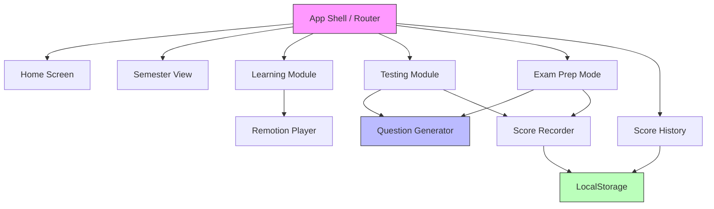

# Design Document: HK P1 Math Learning Platform

## Overview

This document describes the technical design for an interactive math learning and testing platform targeting Hong Kong Primary 1 (小學一年級) students. The platform is a React-based single-page application that uses the Remotion library for programmatic math concept animations, local storage for data persistence, and a question generation engine with adjustable difficulty.

The application covers the full HK P1 math curriculum across two semesters (上學期 and 下學期), providing:
- Interactive learning modules with animated math concept explanations
- Topic-specific testing modules for revision
- Exam preparation mode with mixed-topic question sets
- Score tracking and history with filtering capabilities
- Three difficulty levels (Easy / Medium / Hard)

### Key Design Decisions

1. **Client-side only**: No backend server. All data persists in `localStorage`. This keeps deployment simple and avoids authentication complexity for young children.
2. **Remotion for animations**: Remotion renders React components as video-like sequences, allowing programmatic creation of math animations without pre-rendered video files.
3. **Question generation at runtime**: Questions are generated algorithmically based on topic and difficulty, rather than stored in a static question bank. This provides variety across attempts.
4. **Traditional Chinese UI**: All curriculum labels and student-facing text use 繁體中文, matching the HK school environment.

## Architecture

The application follows a standard React SPA architecture with client-side routing and local state management.



### Technology Stack

| Layer | Technology |
|-------|-----------|
| Framework | React 18+ with TypeScript |
| Build Tool | Vite |
| Routing | React Router v6 |
| Animations | Remotion (`@remotion/player` for inline playback) |
| Styling | CSS Modules or Tailwind CSS |
| State Management | React Context + useReducer (lightweight, no Redux needed) |
| Storage | Browser localStorage |
| Testing | Vitest + React Testing Library + fast-check (property-based) |
| Language | TypeScript |

### Routing Structure

| Route | Component | Description |
|-------|-----------|-------------|
| `/` | `HomeScreen` | Semester selection (上學期 / 下學期) |
| `/semester/:semesterId` | `SemesterView` | Topic list for selected semester |
| `/learn/:topicId` | `LearningModule` | Animated lesson for a topic |
| `/test/:topicId` | `TestingModule` | Practice questions for a topic |
| `/exam/:semesterId` | `ExamPrepMode` | Mixed-topic exam preparation |
| `/scores` | `ScoreHistory` | Score records with filtering |

## Components and Interfaces

### Core Components


#### 1. HomeScreen

Displays two large, colorful semester cards (上學期 / 下學期) and a link to score history. Uses large tap targets (≥48×48px) per Requirement 7.

#### 2. SemesterView

Lists all topics for the selected semester as large icon cards. Each card shows the topic name in Traditional Chinese with an illustrative icon.

#### 3. LearningModule

Renders a Remotion `<Player>` component inline with the lesson content. Provides play/pause/restart controls. On completion, offers "Go to Test" or "Replay" buttons. Falls back to a static image if the Remotion animation fails to render.

```typescript
interface LearningModuleProps {
  topicId: string;
}
```

#### 4. TestingModule

Presents questions one at a time. Shows immediate correct/incorrect feedback after each answer. Displays a visual explanation on incorrect answers. Shows a summary screen on completion with score, correct count, and incorrect count.

```typescript
interface TestingModuleProps {
  topicId: string;
  difficulty: DifficultyLevel;
  questionCount?: number; // defaults based on topic
}
```

#### 5. ExamPrepMode

Generates 15–30 mixed-topic questions for a semester. On completion, shows per-topic score breakdown plus overall summary. Stores results as an exam preparation Score_Record.

#### 6. ScoreHistory

Displays all Score_Records in a list ordered by date. Provides filter controls for semester and topic.

#### 7. RemotionAnimationPlayer

Wrapper around Remotion's `<Player>` that handles:
- Loading the correct animation composition for a topic
- Playback controls (play, pause, restart)
- Error boundary with static fallback image

```typescript
interface RemotionAnimationPlayerProps {
  topicId: string;
  onComplete?: () => void;
}
```

### Question Generator Interface

The question generator is the core engine that produces math questions based on topic and difficulty.

```typescript
interface Question {
  id: string;
  topicId: string;
  difficulty: DifficultyLevel;
  prompt: string;           // The question text (繁體中文)
  options: string[];         // Multiple choice options
  correctAnswerIndex: number;
  explanation: string;       // Brief explanation shown on incorrect answer
  graphicType?: string;      // Optional graphic hint (e.g., 'counting-objects', 'shape')
}

interface QuestionGeneratorConfig {
  topicId: string;
  difficulty: DifficultyLevel;
  count: number;
}

function generateQuestions(config: QuestionGeneratorConfig): Question[];
```

Each topic has a dedicated generator function that produces randomized questions within the constraints of the topic and difficulty level:

| Difficulty | Behavior |
|-----------|----------|
| Easy (容易) | Smaller numbers, single-step operations, visual aids |
| Medium (中等) | Mid-range numbers, standard operations |
| Hard (困難) | Larger numbers, multi-step problems, fewer visual hints |

### Topic Registry

A static registry maps topic IDs to their metadata, generator functions, and animation compositions.

```typescript
interface TopicDefinition {
  id: string;
  name: string;              // Traditional Chinese name
  semester: 'sem1' | 'sem2';
  animationComposition: React.FC; // Remotion composition
  fallbackImage: string;     // Static fallback image path
  generateQuestions: (difficulty: DifficultyLevel, count: number) => Question[];
}

const TOPIC_REGISTRY: Record<string, TopicDefinition>;
```

## Data Models

### DifficultyLevel

```typescript
type DifficultyLevel = 'easy' | 'medium' | 'hard';

const DIFFICULTY_LABELS: Record<DifficultyLevel, string> = {
  easy: '容易',
  medium: '中等',
  hard: '困難',
};
```

### ScoreRecord

```typescript
interface ScoreRecord {
  id: string;                // UUID
  topicId: string | null;    // null for exam prep attempts
  semester: 'sem1' | 'sem2';
  difficulty: DifficultyLevel;
  score: number;             // Number of correct answers
  totalQuestions: number;     // Total questions in the attempt
  date: string;              // ISO 8601 date string
  isExamPrep: boolean;       // true if this is an Exam Preparation attempt
  topicBreakdown?: TopicScoreBreakdown[]; // Only for exam prep
}

interface TopicScoreBreakdown {
  topicId: string;
  correct: number;
  total: number;
}
```

### Semester Data

```typescript
interface SemesterDefinition {
  id: 'sem1' | 'sem2';
  name: string;              // '上學期' or '下學期'
  topics: string[];          // Array of topic IDs
}

const SEMESTERS: SemesterDefinition[] = [
  {
    id: 'sem1',
    name: '上學期',
    topics: ['counting', 'addition-10', 'subtraction-10', 'shapes', 'compare-length-height', 'ordering-sequences'],
  },
  {
    id: 'sem2',
    name: '下學期',
    topics: ['addition-20', 'subtraction-20', 'telling-time', 'coins-notes', 'composing-shapes', 'data-handling'],
  },
];
```

### LocalStorage Schema

All data is stored under a single key in localStorage:

```typescript
interface AppStorageData {
  scoreRecords: ScoreRecord[];
  lastDifficulty?: DifficultyLevel; // Remember last selected difficulty
}

const STORAGE_KEY = 'hk-p1-math-platform';
```

Storage operations:
- `loadScoreRecords(): ScoreRecord[]` — Parse from localStorage, return `[]` if empty/corrupt
- `saveScoreRecord(record: ScoreRecord): void` — Append to existing records and persist
- `getFilteredRecords(filters: { semester?: string; topicId?: string }): ScoreRecord[]` — Filter in-memory


## Correctness Properties

*A property is a characteristic or behavior that should hold true across all valid executions of a system — essentially, a formal statement about what the system should do. Properties serve as the bridge between human-readable specifications and machine-verifiable correctness guarantees.*

### Property 1: Question generator produces valid questions

*For any* topic ID and *for any* difficulty level, every question returned by `generateQuestions` should have a `topicId` matching the requested topic, a `difficulty` matching the requested difficulty, a non-empty `prompt`, at least two `options`, a `correctAnswerIndex` within the bounds of the options array, and a non-empty `explanation`.

**Validates: Requirements 3.1, 3.4, 5.2**

### Property 2: Answer evaluation correctness

*For any* question and *for any* submitted answer index, the answer is evaluated as correct if and only if the submitted index equals the question's `correctAnswerIndex`.

**Validates: Requirements 3.3**

### Property 3: Score summary invariant

*For any* list of question-answer pairs from a completed testing session, the computed score (correct count) plus the incorrect count must equal the total number of questions, and the score must equal the count of answers where the submitted index matches the `correctAnswerIndex`.

**Validates: Requirements 3.5**

### Property 4: Score record completeness

*For any* completed testing attempt (regular or exam prep), the stored `ScoreRecord` must contain a non-null `semester`, a valid `difficulty`, a `score` between 0 and `totalQuestions` inclusive, a valid ISO 8601 `date` string, and `isExamPrep` set to `true` if and only if the attempt was an exam preparation session.

**Validates: Requirements 4.1, 6.5**

### Property 5: Score records are sorted by date

*For any* set of score records returned by the score history view, each record's date must be greater than or equal to the date of the record that follows it (descending chronological order).

**Validates: Requirements 4.2**

### Property 6: Score record filtering

*For any* set of score records and *for any* filter combination of semester and/or topic, every record in the filtered result must match all active filter criteria, and no record matching the criteria should be excluded.

**Validates: Requirements 4.3**

### Property 7: Score record localStorage round trip

*For any* valid `ScoreRecord`, saving it to localStorage via `saveScoreRecord` and then loading all records via `loadScoreRecords` should return a list containing a record equivalent to the original.

**Validates: Requirements 4.4**

### Property 8: Difficulty level scales numeric range

*For any* arithmetic topic (addition, subtraction), the maximum operand value used in questions generated at Easy difficulty must be less than or equal to the maximum operand at Medium difficulty, which must be less than or equal to the maximum operand at Hard difficulty.

**Validates: Requirements 5.4, 5.5**

### Property 9: Exam preparation covers multiple topics

*For any* semester, the set of questions generated for an exam preparation session must include questions from at least two distinct topics within that semester.

**Validates: Requirements 6.1**

### Property 10: Exam preparation question count bounds

*For any* exam preparation session configuration, the number of generated questions must be at least 15 and at most 30.

**Validates: Requirements 6.3**

### Property 11: Exam preparation per-topic breakdown invariant

*For any* completed exam preparation session, the sum of `correct` across all entries in `topicBreakdown` must equal the overall `score`, and the sum of `total` across all entries must equal `totalQuestions`.

**Validates: Requirements 6.4**

### Property 12: Topic registry completeness

*For any* topic in the topic registry, the topic must have a non-null `animationComposition` (Remotion component) and a non-empty `fallbackImage` path.

**Validates: Requirements 2.2, 8.4**

### Property 13: Curriculum labels are in Traditional Chinese

*For any* topic in the topic registry, the `name` field must contain at least one CJK Unified Ideograph character (Unicode range U+4E00–U+9FFF).

**Validates: Requirements 7.4**

## Error Handling

### Animation Failures
- The `RemotionAnimationPlayer` wraps the Remotion `<Player>` in a React error boundary.
- On render failure, the error boundary catches the error and displays the topic's `fallbackImage` as a static `` element.
- Errors are logged to `console.error` for debugging.

### LocalStorage Failures
- `loadScoreRecords()` uses a try/catch around `JSON.parse`. On failure (corrupt data, quota exceeded), it returns an empty array `[]` and logs a warning.
- `saveScoreRecord()` catches `QuotaExceededError` and displays a user-friendly message in Chinese: "儲存空間已滿，請清除舊記錄。"
- The app remains functional even if localStorage is unavailable — scores simply won't persist.

### Question Generation Edge Cases
- If `generateQuestions` is called with an invalid `topicId`, it throws an `Error` with a descriptive message.
- If `count` is 0 or negative, it returns an empty array.
- Each topic generator ensures operands stay within curriculum-appropriate bounds regardless of difficulty.

### Navigation Errors
- Invalid routes redirect to the home screen via a catch-all route.
- If a topic ID in the URL doesn't exist in the registry, the user is redirected to the semester view with a brief toast notification.

## Testing Strategy

### Unit Tests (Vitest + React Testing Library)

Unit tests cover specific examples, edge cases, and integration points:

- **Semester data**: Verify exact topic lists for 上學期 and 下學期 (Requirements 1.3, 1.4)
- **Difficulty defaults**: Verify default difficulty is Easy when unset (Requirement 5.3)
- **UI elements**: Verify home screen renders two semester cards (Requirement 7.1), back button exists in modules (Requirement 7.3), playback controls exist (Requirement 8.3), minimum tap target sizes (Requirement 7.2)
- **Exam prep UI**: Verify semester selection is presented (Requirement 6.2)
- **Animation fallback**: Verify fallback image renders when Remotion player errors (Requirement 8.4)
- **Edge cases**: Empty localStorage, corrupt localStorage data, invalid topic IDs, zero question count

### Property-Based Tests (Vitest + fast-check)

Each correctness property from the design is implemented as a single property-based test using the `fast-check` library. Each test runs a minimum of 100 iterations.

Tests are tagged with comments in the format:
```
// Feature: hk-p1-math-learning-platform, Property {N}: {property title}
```

Property tests to implement:
1. **Property 1**: Generate random topic IDs and difficulty levels, verify all returned questions have correct fields
2. **Property 2**: Generate random questions and answer indices, verify evaluation logic
3. **Property 3**: Generate random answer arrays, verify score computation invariant
4. **Property 4**: Generate random attempt data, verify stored record completeness
5. **Property 5**: Generate random score record sets, verify date ordering
6. **Property 6**: Generate random records and filter combinations, verify filter correctness
7. **Property 7**: Generate random ScoreRecords, save/load round trip
8. **Property 8**: For arithmetic topics, generate questions at all three difficulties, verify operand range ordering
9. **Property 9**: Generate exam prep sessions for each semester, verify multi-topic coverage
10. **Property 10**: Generate random exam prep configs, verify question count bounds
11. **Property 11**: Generate random exam prep results, verify breakdown sums
12. **Property 12**: Iterate all topics in registry, verify animation and fallback presence
13. **Property 13**: Iterate all topics in registry, verify Chinese characters in name

### Test Organization

```
src/
  __tests__/
    unit/
      semester-data.test.ts
      difficulty-defaults.test.ts
      ui-elements.test.tsx
      localStorage.test.ts
    properties/
      question-generator.property.test.ts
      answer-evaluation.property.test.ts
      score-summary.property.test.ts
      score-record.property.test.ts
      score-history.property.test.ts
      difficulty-scaling.property.test.ts
      exam-prep.property.test.ts
      topic-registry.property.test.ts
```
